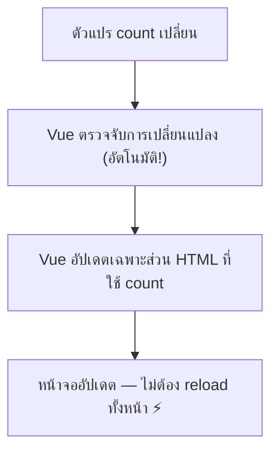

# บทที่ 2: สร้าง Counter App ด้วย Options API

> 📍 **บทที่ 2 / 10** ━━━━━━━━━━ `[████░░░░░░]`

| ⬅️ [บทที่ 1: สร้างโปรเจกต์](./lesson-1-create-project.md) | [สารบัญ](./tutorial.md) | [บทที่ 3: ทำความเข้าใจ Error ➡️](./lesson-3-vuejs-error.md) |
|:---|:---:|---:|

---

## 🎯 เป้าหมาย

ในบทนี้เราจะ:
- สร้าง Counter App ที่กดเพิ่ม/ลดตัวเลขได้
- **เรียนรู้ Options API** — วิธีจัดโค้ดของ Vue.js
- ใช้ `methods` สร้างฟังก์ชันที่ทำงานเมื่อกดปุ่ม
- ใช้ `v-on` (หรือ `@`) จัดการ event เช่น click

> 🎮 **Fun Fact:** Options API เป็นวิธีเขียน Vue แบบดั้งเดิมที่ใช้มาตั้งแต่ Vue 2
> มันถูกออกแบบมาให้ "จัดระเบียบ" โค้ดตามหน้าที่ — ข้อมูลอยู่ที่นึง ฟังก์ชันอยู่อีกที่นึง
> เหมือนจัดลิ้นชัก: ลิ้นชักเสื้อ, ลิ้นชักกางเกง, ลิ้นชักถุงเท้า 🧦

---

## 📋 สิ่งที่ต้องมีก่อนเริ่ม

- ทำบทที่ 1 เสร็จแล้ว (มีโปรเจกต์ Vue.js ที่รันได้)
- dev server ทำงานอยู่ (`npm run dev`)


---

## 📝 ขั้นตอน

### ขั้นตอนที่ 1: ทำความเข้าใจ Options API

ก่อนเขียนโค้ด มาเข้าใจ **Options API** กันก่อน

ใน Vue.js เราเขียน component ด้วย `export default { ... }` สิ่งที่อยู่ในวงเล็บปีกกา `{ }` คือ **options** — ตัวเลือกต่างๆ ที่บอก Vue ว่า component นี้มีอะไรบ้าง

```js
export default {
  // 📦 Option: data — ข้อมูลของ component
  data() {
    return {
      count: 0
    }
  },

  // 🔧 Option: methods — ฟังก์ชันที่ component ใช้ได้
  methods: {
    increment() {
      this.count++
    }
  }
}
```

> 💡 **Options API = จัดโค้ดตามประเภท**
>
> | Option | หน้าที่ | จำง่ายๆ |
> |--------|--------|---------|
> | `data()` | เก็บ **ข้อมูล** ที่เปลี่ยนแปลงได้ | 📦 กล่องเก็บของ |
> | `methods` | เก็บ **ฟังก์ชัน** ที่ทำงานเมื่อถูกเรียก | 🔧 กล่องเครื่องมือ |
> | `computed` | เก็บ **ค่าที่คำนวณ** จากข้อมูล (จะเรียนในบทหลัง) | 🧮 เครื่องคิดเลข |
> | `mounted()` | โค้ดที่ทำงานเมื่อ component ขึ้นจอ (จะเรียนในบทหลัง) | 🎬 ฉากเปิด |

> 🤔 **`this` คืออะไร?**
>
> ใน `methods` เราใช้ `this.count` แทน `count` ตรงๆ
> `this` หมายถึง **component ตัวนี้เอง** — ใช้เพื่อเข้าถึงข้อมูลใน `data()` และ method อื่นๆ
>
> เปรียบเทียบ: ถ้า component คือ **คน** → `this` คือ **ตัวเอง**
> - `this.count` = "ค่า count **ของฉัน**"
> - `this.increment()` = "เรียกฟังก์ชัน increment **ของฉัน**"

#### ✅ ตรวจสอบ
- [ ] เข้าใจว่า Options API คือการจัดโค้ดตามประเภท (`data`, `methods`, ฯลฯ)
- [ ] เข้าใจว่า `this` ใช้เข้าถึงข้อมูลและ method ของ component

---

### ขั้นตอนที่ 2: สร้าง Counter App — เพิ่มค่าได้!

มาสร้าง Counter App ง่ายๆ กัน เปิดไฟล์ `src/App.vue` แล้ว **ลบโค้ดเดิมทั้งหมด** แล้วพิมพ์โค้ดนี้:

```vue
<script>
export default {
  data() {
    return {
      count: 0
    }
  },

  methods: {
    increment() {
      this.count++
    }
  }
}
</script>

<template>
  <div>
    <h1>🔢 Counter App</h1>
    <p class="count">{{ count }}</p>
    <button @click="increment">+1</button>
  </div>
</template>
```

**กด `Ctrl+S` / `Cmd+S`** แล้วดูที่เบราว์เซอร์ — ลองกดปุ่ม **+1** ดู!

> 💡 **อธิบายโค้ดทีละส่วน:**
>
> **ส่วน `<script>` — สมอง 🧠**
> ```js
> data() {
>   return {
>     count: 0  // ← ตัวแปรเก็บค่า counter เริ่มต้นที่ 0
>   }
> },
> methods: {
>   increment() {
>     this.count++  // ← เพิ่มค่า count ขึ้น 1
>   }
> }
> ```
>
> **ส่วน `<template>` — ร่างกาย 🖥️**
> ```html
> <p class="count">{{ count }}</p>     <!-- แสดงค่า count -->
> <button @click="increment">+1</button>  <!-- กดแล้วเรียก increment() -->
> ```
>
> **`@click` คืออะไร?**
> - `@click="increment"` หมายถึง: **เมื่อกดปุ่มนี้ → เรียกฟังก์ชัน `increment`**
> - `@click` เป็นชื่อย่อของ `v-on:click` (directive ของ Vue สำหรับจัดการ event)
> - ทั้งสองแบบใช้ได้เหมือนกัน แต่ `@click` สั้นกว่า

#### ✅ ตรวจสอบ
- [ ] หน้าเว็บแสดง "🔢 Counter App" กับตัวเลข `0`
- [ ] กดปุ่ม +1 แล้วตัวเลขเพิ่มขึ้นทีละ 1
- [ ] ตัวเลขอัปเดตบนจอทันทีโดยไม่ต้อง refresh (นี่คือ **Reactivity**!)

---

### ขั้นตอนที่ 3: เพิ่มปุ่มลดค่าและ Reset

Counter ที่เพิ่มได้อย่างเดียวยังไม่สนุก มาเพิ่มปุ่ม **ลดค่า** และ **Reset** กัน

แก้ไข `src/App.vue`:

```vue
<script>
export default {
  data() {
    return {
      count: 0
    }
  },

  methods: {
    increment() {
      this.count++
    },
    decrement() {
      this.count--
    },
    reset() {
      this.count = 0
    }
  }
}
</script>

<template>
  <div>
    <h1>🔢 Counter App</h1>
    <p class="count">{{ count }}</p>
    <div class="buttons">
      <button class="btn-minus" @click="decrement">-1</button>
      <button class="btn-reset" @click="reset">Reset</button>
      <button class="btn-plus" @click="increment">+1</button>
    </div>
  </div>
</template>
```

> 💡 **สังเกต pattern:**
> เราเพิ่ม method ใหม่ง่ายมาก — แค่เพิ่มฟังก์ชันใน `methods` แล้วผูกกับ `@click` ในปุ่ม
>
> ```
> 1. สร้างฟังก์ชันใน methods    →  decrement() { this.count-- }
> 2. ผูกกับปุ่มใน template     →  <button @click="decrement">
> 3. จบ! Vue จัดการ update จอให้ ✨
> ```

#### ✅ ตรวจสอบ
- [ ] มีปุ่ม 3 ปุ่ม: -1 (แดง), Reset (เทา), +1 (เขียว)
- [ ] กด -1 แล้วตัวเลขลดลง (สามารถติดลบได้)
- [ ] กด Reset แล้วตัวเลขกลับเป็น 0

---

### ขั้นตอนที่ 4: เพิ่ม Dynamic Style ด้วย `:class`

ตอนนี้ตัวเลขเป็นสีดำตลอด ถ้าตัวเลข **ติดลบแสดงสีแดง** และ **บวกแสดงสีเขียว** จะดีกว่าไหม?

Vue มี directive ชื่อ `:class` (ย่อมาจาก `v-bind:class`) ที่เปลี่ยน CSS class ตามเงื่อนไขได้

แก้ไขเฉพาะส่วน `<template>` และ `<style>`:

**`<template>` — เปลี่ยนบรรทัด `<p>` เป็น:**
```html
<p
  class="count"
  :class="{
    positive: count > 0,
    negative: count < 0
  }"
>
  {{ count }}
</p>
```

**`<style>` — เพิ่ม CSS class ใหม่ (ใส่ใน `<style>` ของ `.vue` ไฟล์):**
```css
.positive { color: #42b883; }
.negative { color: #e74c3c; }
```

> 💡 **`:class` ทำงานยังไง?**
>
> ```html
> :class="{
>   positive: count > 0,   ← ถ้า count > 0  → เพิ่ม class "positive"
>   negative: count < 0    ← ถ้า count < 0  → เพิ่ม class "negative"
> }"
> ```
>
> `:class` รับ object ที่ **key** คือชื่อ class และ **value** คือเงื่อนไข (true/false)
> - ถ้า `count` = 5 → `<p class="count positive">`
> - ถ้า `count` = -3 → `<p class="count negative">`
> - ถ้า `count` = 0 → `<p class="count">` (ไม่มี class เพิ่มเติม)
>
> สังเกตว่า `class="count"` (class ปกติ) กับ `:class` (class แบบมีเงื่อนไข) ใช้คู่กันได้!

ลองกดปุ่มแล้วดูสีตัวเลขเปลี่ยนตามค่า 🎨

#### ✅ ตรวจสอบ
- [ ] ตัวเลข 0 เป็นสีดำ (สีเริ่มต้น)
- [ ] กด +1 → ตัวเลขเปลี่ยนเป็นสีเขียว
- [ ] กด -1 จนติดลบ → ตัวเลขเปลี่ยนเป็นสีแดง
- [ ] กด Reset → กลับเป็นสีดำ

---

### ขั้นตอนที่ 5: เพิ่ม Step — ปรับจำนวนเพิ่ม/ลดได้

ตอนนี้เพิ่ม/ลดทีละ 1 อย่างเดียว ถ้าเลือกได้ว่าจะเพิ่ม/ลดทีละเท่าไหร่จะดีกว่า

เราจะเรียนรู้วิธี **ส่ง parameter ให้ method** ผ่าน `@click`

แก้ไข `src/App.vue` ทั้งไฟล์:

```vue
<script>
export default {
  data() {
    return {
      count: 0,
      step: 1
    }
  },

  methods: {
    increment() {
      this.count += this.step
    },
    decrement() {
      this.count -= this.step
    },
    reset() {
      this.count = 0
    },
    setStep(newStep) {
      this.step = newStep
    }
  }
}
</script>

<template>
  <div>
    <h1>🔢 Counter App</h1>

    <p
      class="count"
      :class="{
        positive: count > 0,
        negative: count < 0
      }"
    >
      {{ count }}
    </p>

    <div class="buttons">
      <button class="btn-minus" @click="decrement">-{{ step }}</button>
      <button class="btn-reset" @click="reset">Reset</button>
      <button class="btn-plus" @click="increment">+{{ step }}</button>
    </div>

    <div class="step-selector">
      <p>ปรับ Step:</p>
      <button
        v-for="s in [1, 5, 10, 100]"
        :key="s"
        :class="{ active: step === s }"
        @click="setStep(s)"
      >
        {{ s }}
      </button>
    </div>
  </div>
</template>
```

> 💡 **สิ่งใหม่ในขั้นตอนนี้:**
>
> **1. ส่ง parameter ให้ method:**
> ```html
> <button @click="setStep(s)">  ← ส่งค่า s เข้าไปในฟังก์ชัน
> ```
> ```js
> setStep(newStep) {           // ← รับค่าที่ส่งมา
>   this.step = newStep
> }
> ```
>
> **2. `v-for` — วนลูปสร้าง element ซ้ำๆ:**
> ```html
> <button v-for="s in [1, 5, 10, 100]" :key="s">
> ```
> `v-for` จะสร้างปุ่ม 4 ปุ่ม โดย `s` จะมีค่าเป็น 1, 5, 10, 100 ตามลำดับ
>
> `:key="s"` → บอก Vue ว่าแต่ละปุ่มเป็นอันไหน (Vue ต้องการ key เพื่อจัดการ list ได้ถูกต้อง)
>
> **3. `{{ step }}` ในปุ่ม:**
> ```html
> <button>+{{ step }}</button>  ← แสดง +1, +5, +10, +100 ตามค่า step ปัจจุบัน
> ```
>


#### ✅ ตรวจสอบ
- [ ] มี Step selector แสดงปุ่ม 1, 5, 10, 100
- [ ] คลิกเลข 5 → ปุ่มเปลี่ยนเป็น +5 / -5 และค่าเพิ่ม/ลดทีละ 5
- [ ] ปุ่ม Step ที่เลือกอยู่จะมี class `active`

---

### ขั้นตอนที่ 6: เข้าใจ Reactivity — หัวใจของ Vue.js

ตลอดบทนี้ เราแค่เปลี่ยนค่าตัวแปร (`this.count++`) แล้วหน้าจอก็อัปเดตเอง **ทำไม?**

นี่คือ **Reactivity** — ความสามารถที่สำคัญที่สุดของ Vue.js



> 🤔 **ถ้าไม่มี Reactivity จะเป็นยังไง?**
>
> ใน JavaScript ธรรมดา ถ้าเราเปลี่ยนค่าตัวแปร หน้าเว็บจะ **ไม่อัปเดต** — เราต้องเขียนโค้ดจัดการ DOM เอง:
>
> ```js
> // ❌ JavaScript ธรรมดา — ต้องอัปเดต DOM เอง
> let count = 0
> count++
> document.getElementById('count').textContent = count  // ต้องเขียนเอง!
> ```
>
> ```js
> // ✅ Vue.js — อัปเดตอัตโนมัติ
> this.count++  // แค่นี้! Vue จัดการ DOM ให้ 🎉
> ```
>
> เปรียบเทียบ: Reactivity เหมือน **Google Sheets** — แก้ตัวเลขในช่องหนึ่ง สูตรที่ใช้ตัวเลขนั้นก็คำนวณใหม่ทันที

#### ✅ ตรวจสอบ
- [ ] เข้าใจว่า Reactivity = Vue ตรวจจับการเปลี่ยนแปลงข้อมูลแล้วอัปเดต UI อัตโนมัติ
- [ ] เข้าใจว่าข้อมูลใน `data()` เท่านั้นที่เป็น reactive

---

## ❌ ปัญหาที่พบบ่อย

### ปัญหา: กดปุ่มแล้วตัวเลขไม่เปลี่ยน

**สาเหตุ:** ลืมใช้ `this` หน้าตัวแปร

**วิธีแก้:**
```js
// ❌ ผิด — count ไม่มี this
methods: {
  increment() {
    count++
  }
}

// ✅ ถูก — ใช้ this.count
methods: {
  increment() {
    this.count++
  }
}
```

---

### ปัญหา: `[Vue warn]: Method "increment" has already been defined as a data property`

**สาเหตุ:** ตั้งชื่อ method ซ้ำกับชื่อตัวแปรใน `data()`

**วิธีแก้:** ตรวจสอบว่าชื่อใน `data()` และ `methods` ไม่ซ้ำกัน

```js
// ❌ ผิด — ชื่อ count ซ้ำกัน
data() {
  return { count: 0 }
},
methods: {
  count() { ... }  // ซ้ำกับ data!
}

// ✅ ถูก — ใช้ชื่อต่างกัน
data() {
  return { count: 0 }
},
methods: {
  increment() { ... }
}
```

---

### ปัญหา: กดปุ่มแล้วเจอ error `is not a function`

**สาเหตุ:** พิมพ์ชื่อฟังก์ชันใน `@click` ผิด หรือลืมสร้างฟังก์ชันใน `methods`

**วิธีแก้:**
1. ตรวจสอบว่าชื่อใน `@click="xxx"` ตรงกับชื่อใน `methods` **ตัวพิมพ์เล็ก/ใหญ่ต้องตรงกัน**
2. ตรวจว่าฟังก์ชันอยู่ภายใน `methods: { }` ไม่ได้อยู่นอก

---

### ปัญหา: `:class` ไม่ทำงาน — สีไม่เปลี่ยน

**สาเหตุ:** ลืมเครื่องหมาย `:` หน้า `class`

**วิธีแก้:**
```html
<!-- ❌ ผิด — ไม่มี : → Vue ไม่ evaluate เงื่อนไข -->
<p class="{ positive: count > 0 }">

<!-- ✅ ถูก — มี : → Vue จะ evaluate เงื่อนไขให้ -->
<p :class="{ positive: count > 0 }">
```

---

## 🏋️ ลองทำเอง (Challenge)

### ⭐ ระดับง่าย
เพิ่มตัวเลข step ใหม่ เช่น `50` หรือ `1000` ในปุ่ม Step selector

### ⭐⭐ ระดับปานกลาง
เพิ่ม **Max / Min limit** — ไม่ให้ค่าเกิน 999 หรือต่ำกว่า -999
- ถ้า count ถึง max → ปุ่ม +N ควรถูก disable (ใช้ attribute `:disabled`)
- ถ้า count ถึง min → ปุ่ม -N ควรถูก disable

### ⭐⭐⭐ ระดับยาก
เพิ่ม **ประวัติการกด** (History) — แสดงรายการค่าที่เคยกด เช่น `0 → 1 → 6 → 5`
- ใช้ array เก็บประวัติ
- ใช้ `v-for` แสดงรายการ
- เพิ่มปุ่ม "ล้างประวัติ"

<details>
<summary>💡 คำใบ้ระดับง่าย</summary>

แก้ array ใน `v-for`:
```html
<button v-for="s in [1, 5, 10, 50, 100, 1000]" :key="s">
```

</details>

<details>
<summary>💡 คำใบ้ระดับปานกลาง</summary>

1. เพิ่มตัวแปร `max` และ `min` ใน `data()`:
```js
data() {
  return {
    count: 0,
    step: 1,
    max: 999,
    min: -999
  }
}
```

2. ใน `increment()` เช็คก่อนเพิ่ม:
```js
increment() {
  if (this.count + this.step <= this.max) {
    this.count += this.step
  }
}
```

3. ใช้ `:disabled` attribute ในปุ่ม:
```html
<button :disabled="count + step > max" @click="increment">
```

</details>

<details>
<summary>💡 คำใบ้ระดับยาก</summary>

1. เพิ่ม `history: [0]` ใน `data()`
2. ทุกครั้งที่เปลี่ยนค่า count → `this.history.push(this.count)`
3. ใน template:
```html
<div class="history">
  <h3>📜 History</h3>
  <p>{{ history.join(' → ') }}</p>
  <button @click="clearHistory">ล้างประวัติ</button>
</div>
```

</details>

<details>
<summary>✅ ดูเฉลยระดับปานกลาง</summary>

```vue
<script>
export default {
  data() {
    return {
      count: 0,
      step: 1,
      max: 999,
      min: -999
    }
  },

  methods: {
    increment() {
      const newValue = this.count + this.step
      if (newValue <= this.max) {
        this.count = newValue
      }
    },
    decrement() {
      const newValue = this.count - this.step
      if (newValue >= this.min) {
        this.count = newValue
      }
    },
    reset() {
      this.count = 0
    },
    setStep(newStep) {
      this.step = newStep
    }
  }
}
</script>

<template>
  <div>
    <h1>🔢 Counter App</h1>
    <p class="limit">Min: {{ min }} | Max: {{ max }}</p>

    <p
      class="count"
      :class="{
        positive: count > 0,
        negative: count < 0
      }"
    >
      {{ count }}
    </p>

    <div class="buttons">
      <button
        class="btn-minus"
        :disabled="count - step < min"
        @click="decrement"
      >
        -{{ step }}
      </button>
      <button class="btn-reset" @click="reset">Reset</button>
      <button
        class="btn-plus"
        :disabled="count + step > max"
        @click="increment"
      >
        +{{ step }}
      </button>
    </div>

    <div class="step-selector">
      <p>ปรับ Step:</p>
      <button
        v-for="s in [1, 5, 10, 100]"
        :key="s"
        :class="{ active: step === s }"
        @click="setStep(s)"
      >
        {{ s }}
      </button>
    </div>
  </div>
</template>
```

</details>

<details>
<summary>✅ ดูเฉลยระดับยาก</summary>

```vue
<script>
export default {
  data() {
    return {
      count: 0,
      step: 1,
      history: [0]
    }
  },

  methods: {
    increment() {
      this.count += this.step
      this.history.push(this.count)
    },
    decrement() {
      this.count -= this.step
      this.history.push(this.count)
    },
    reset() {
      this.count = 0
      this.history.push(0)
    },
    setStep(newStep) {
      this.step = newStep
    },
    clearHistory() {
      this.history = [this.count]
    }
  }
}
</script>

<template>
  <div>
    <h1>🔢 Counter App</h1>

    <p
      class="count"
      :class="{
        positive: count > 0,
        negative: count < 0
      }"
    >
      {{ count }}
    </p>

    <div class="buttons">
      <button class="btn-minus" @click="decrement">-{{ step }}</button>
      <button class="btn-reset" @click="reset">Reset</button>
      <button class="btn-plus" @click="increment">+{{ step }}</button>
    </div>

    <div class="step-selector">
      <p>ปรับ Step:</p>
      <button
        v-for="s in [1, 5, 10, 100]"
        :key="s"
        :class="{ active: step === s }"
        @click="setStep(s)"
      >
        {{ s }}
      </button>
    </div>

    <div class="history">
      <h3>📜 History</h3>
      <p>{{ history.join(' → ') }}</p>
      <button class="btn-reset" @click="clearHistory">ล้างประวัติ</button>
    </div>
  </div>
</template>
```

</details>

---

## 📖 คำศัพท์ที่เรียนรู้ในบทนี้

| คำศัพท์ | ความหมาย | เปรียบเทียบ |
|---------|----------|-------------|
| Options API | วิธีเขียน Vue ด้วยการจัด "options" ตามประเภท | เหมือนจัดลิ้นชัก — แยกเสื้อ กางเกง ถุงเท้า |
| `methods` | เก็บฟังก์ชันที่ component ใช้ได้ | เหมือนกล่องเครื่องมือ — มีเท่าไหร่ก็ได้ |
| `this` | อ้างอิงถึง component ตัวเอง | เหมือนคำว่า "ของฉัน" — `this.count` = count ของฉัน |
| `@click` | ย่อมาจาก `v-on:click` — จัดการ event คลิก | เหมือนปุ่มกริ่ง — กดแล้วเกิดอะไร |
| `:class` | ย่อมาจาก `v-bind:class` — เปลี่ยน class ตามเงื่อนไข | เหมือนเปลี่ยนเสื้อตามอุณหภูมิ — ร้อนใส่สีอ่อน หนาวใส่สีเข้ม |
| `v-for` | วนลูปสร้าง element ซ้ำจาก array | เหมือนเครื่องปั๊ม — ป้อนข้อมูล กี่ชิ้นก็ผลิตได้ |
| Reactivity | ระบบตรวจจับการเปลี่ยนแปลงข้อมูลแล้วอัปเดต UI อัตโนมัติ | เหมือน Google Sheets — แก้เลข สูตรก็คำนวณใหม่ |
| Event Handling | การจัดการเหตุการณ์ที่เกิดจากผู้ใช้ (คลิก, พิมพ์, ฯลฯ) | เหมือนพนักงานรับออเดอร์ — ลูกค้าสั่ง ก็ทำตาม |

---

## สรุปสิ่งที่ได้เรียนรู้ ✅

| หัวข้อ | สิ่งที่เรียนรู้ |
|--------|----------------|
| Options API | จัดโค้ดตามประเภท: `data()`, `methods`, `computed`, ฯลฯ |
| `data()` | เก็บข้อมูล reactive ที่เปลี่ยนแปลงได้ |
| `methods` | เก็บฟังก์ชันที่ถูกเรียกจาก event หรือ method อื่น |
| `@click` | ผูกฟังก์ชันกับ event click ของปุ่ม |
| `:class` | เปลี่ยน CSS class ตามเงื่อนไข |
| `v-for` | วนลูปสร้าง element จาก array |
| `this` | อ้างอิงถึง component — ใช้เข้าถึง data และ methods |
| Reactivity | เปลี่ยนข้อมูล → UI อัปเดตอัตโนมัติ |

---

> ➡️ **บทถัดไป:** [บทที่ 3: ทำความเข้าใจ Error ใน Vue.js](./lesson-3-vuejs-error.md)
