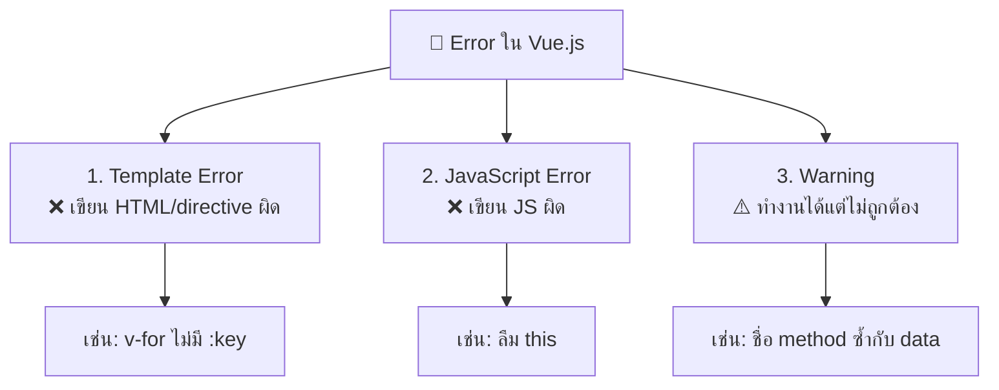
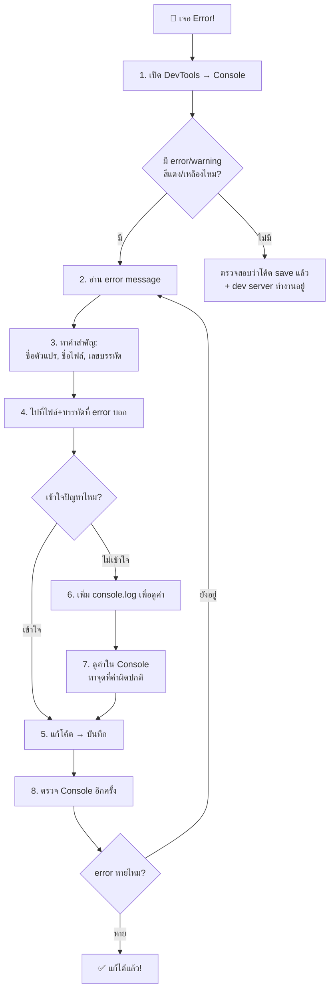

# บทที่ 3: ทำความเข้าใจ Error ใน Vue.js

> 📍 **บทที่ 3 / 10** ━━━━━━━━━━ `[██████░░░░]`

| ⬅️ [บทที่ 2: Counter App](./lesson-2-counter-app.md) | [สารบัญ](./tutorial.md) | [บทที่ 4: Vue Router ➡️](./lesson-4-vue-router.md) |
|:---|:---:|---:|

---

## 🎯 เป้าหมาย

ในบทนี้เราจะ:
- **เรียนรู้วิธีอ่าน error message** ของ Vue.js ให้เข้าใจ
- ใช้ **Browser DevTools** (Console, Elements) เพื่อ debug
- ลองสร้าง error จริง แล้วฝึกแก้แต่ละแบบ
- เข้าใจ **ประเภทของ error** ที่พบบ่อยใน Vue.js

> 🎮 **Fun Fact:** นักพัฒนามืออาชีพใช้เวลาประมาณ 50% ในการ debug
> ทักษะการอ่าน error และ debug เป็นทักษะที่สำคัญที่สุดอย่างหนึ่ง
> "ทุก error คือครู — มันบอกเราว่าอะไรผิด ถ้าเราอ่านมันเป็น" 🧑‍🏫

---

## 📋 สิ่งที่ต้องมีก่อนเริ่ม

- ทำบทที่ 2 เสร็จแล้ว (มี Counter App ที่ทำงานได้)
- dev server ทำงานอยู่ (`npm run dev`)
- เปิด DevTools ของเบราว์เซอร์ได้ (กด `F12` หรือ `Cmd+Option+I` บน Mac)

> 💡 **ถ้ายังไม่ได้ทำบทก่อนหน้า** สามารถเริ่มจาก branch สำเร็จได้:
> ```bash
> git checkout lesson-2-completed
> ```

---

## 📝 ขั้นตอน

### ขั้นตอนที่ 1: รู้จัก Browser DevTools — เครื่องมือ Debug ตัวแรก

ก่อนจะ debug ได้ต้องรู้จักเครื่องมือก่อน! **Browser DevTools** คือเครื่องมือที่ติดมากับเบราว์เซอร์ทุกตัว

วิธีเปิด DevTools:

| เบราว์เซอร์ | Windows/Linux | Mac |
|-------------|---------------|-----|
| Chrome | `F12` หรือ `Ctrl+Shift+I` | `Cmd+Option+I` |
| Firefox | `F12` หรือ `Ctrl+Shift+I` | `Cmd+Option+I` |
| Edge | `F12` | `Cmd+Option+I` |

เปิด DevTools แล้วลองดู **3 แท็บที่สำคัญ:**

| แท็บ | หน้าที่ | ใช้เมื่อไหร่ |
|------|--------|-------------|
| **Console** | แสดง error, warning, และ log | ดู error message, ทดสอบ JavaScript |
| **Elements** | แสดง HTML + CSS ที่ render แล้ว | ตรวจสอบว่า HTML ถูกสร้างถูกต้อง |
| **Network** | แสดง HTTP request ทั้งหมด | ตรวจสอบ API call (จะใช้ในบทหลัง) |

> 💡 **เคล็ดลับ:**
> ใน Console tab ลองพิมพ์ `console.log("Hello!")` แล้วกด Enter
> จะเห็นข้อความ `Hello!` แสดงออกมา — นี่คือวิธีง่ายที่สุดในการ debug!

#### ✅ ตรวจสอบ
- [ ] เปิด DevTools ได้สำเร็จ (กด `F12`)
- [ ] เห็นแท็บ Console, Elements, Network
- [ ] ลองพิมพ์ `console.log("Hello!")` ใน Console แล้วเห็นผลลัพธ์

---

### ขั้นตอนที่ 2: ประเภทของ Error ใน Vue.js

Error ใน Vue.js แบ่งได้เป็น **3 ประเภทหลัก:**



> 💡 **จำไว้:**
> | สัญลักษณ์ | ความหมาย | ความร้ายแรง |
> |-----------|----------|------------|
> | ❌ **Error** (สีแดง) | โค้ดทำงานไม่ได้ ต้องแก้ | ร้ายแรง — หน้าเว็บอาจพัง |
> | ⚠️ **Warning** (สีเหลือง) | โค้ดทำงานได้แต่มีปัญหาซ่อนอยู่ | ปานกลาง — ควรแก้เพื่อป้องกันบัค |
> | ℹ️ **Info** (สีน้ำเงิน/เทา) | ข้อมูลทั่วไป | ไม่ร้ายแรง — แค่ข้อมูลเพิ่มเติม |

#### ✅ ตรวจสอบ
- [ ] เข้าใจว่า Error ใน Vue.js มี 3 ประเภทหลัก
- [ ] เข้าใจว่าสีแดง = ต้องแก้, สีเหลือง = ควรแก้

---

### ขั้นตอนที่ 3: ลอง Error จริง — Template Error

มาลองสร้าง error จริงกัน! เราจะเรียนรู้จากการทำผิดแล้วแก้ไข

เปิดไฟล์ `src/App.vue` แล้วลบโค้ดเดิมทั้งหมด พิมพ์โค้ดนี้ (**โค้ดนี้มี bug ตั้งใจ!**):

```vue
<script>
export default {
  data() {
    return {
      message: 'สวัสดี Vue.js! 🎉',
      items: ['แอปเปิ้ล', 'กล้วย', 'ส้ม']
    }
  }
}
</script>

<template>
  <div>
    <h1>{{ message }}</h1>

    <h2>🛒 รายการผลไม้</h2>
    <ul>
      <li v-for="item in items">{{ item }}</li>
    </ul>
  </div>
</template>
```

**กด `Ctrl+S` / `Cmd+S`** แล้วดูที่ **DevTools → Console**

จะเห็น warning สีเหลืองประมาณนี้:

```
[Vue warn]: <li v-for="item in items">: component lists rendered with
v-for should have explicit keys. ...
```

> 💡 **อ่าน error message ยังไง?**
>
> มาแยก error ทีละส่วน:
>
> ```
> [Vue warn]:                          ← 🏷️ ประเภท: Warning จาก Vue
> <li v-for="item in items">:         ← 📍 ที่ไหน: element <li> ที่มี v-for
> component lists rendered with        ← 📝 ปัญหา: list ที่ render ด้วย v-for
> v-for should have explicit keys.     ← 💡 วิธีแก้: ควรมี key
> ```
>
> **สูตรอ่าน error:** `[ใครพูด] : [ที่ไหน] : [ปัญหาคืออะไร] : [แนะนำวิธีแก้]`

**วิธีแก้:** เพิ่ม `:key` ให้ `v-for`:

```html
<!-- ❌ ก่อนแก้ — ไม่มี :key -->
<li v-for="item in items">{{ item }}</li>

<!-- ✅ หลังแก้ — มี :key -->
<li v-for="(item, index) in items" :key="index">{{ item }}</li>
```

> 🤔 **ทำไม v-for ต้องมี :key?**
>
> Vue ใช้ `:key` เพื่อ **บอกว่าแต่ละ element เป็นตัวไหน** เมื่อข้อมูลเปลี่ยน
>
> ลองคิดแบบนี้: ถ้ามีนักเรียน 30 คนยืนเรียงแถว แล้วครูต้องย้ายที่ 1 คน
> - **ไม่มี key:** ครูจัดแถวใหม่ทั้งหมด 30 คน (ช้า!)
> - **มี key (เลขประจำตัว):** ครูย้ายแค่คนเดียว (เร็ว!)

แก้โค้ดในไฟล์ `src/App.vue`:

```vue
<script>
export default {
  data() {
    return {
      message: 'สวัสดี Vue.js! 🎉',
      items: ['แอปเปิ้ล', 'กล้วย', 'ส้ม']
    }
  }
}
</script>

<template>
  <div>
    <h1>{{ message }}</h1>

    <h2>🛒 รายการผลไม้</h2>
    <ul>
      <li v-for="(item, index) in items" :key="index">{{ item }}</li>
    </ul>
  </div>
</template>
```

บันทึกแล้วดู Console — warning หายไป! 🎉

#### ✅ ตรวจสอบ
- [ ] เห็น warning ใน Console เกี่ยวกับ `v-for` ไม่มี `key`
- [ ] เพิ่ม `:key` แล้ว warning หายไป
- [ ] เข้าใจสูตรอ่าน error: `[ใครพูด] [ที่ไหน] [ปัญหา] [วิธีแก้]`

---

### ขั้นตอนที่ 4: ลอง Error จริง — JavaScript Error (ลืม `this`)

นี่คือ error ที่พบบ่อยมาก! มาลองกัน

แก้ไข `src/App.vue` เป็นโค้ดนี้ (**มี bug!**):

```vue
<script>
export default {
  data() {
    return {
      count: 0
    }
  },

  methods: {
    increment() {
      count++    // ← 🐛 Bug! ลืม this
    }
  }
}
</script>

<template>
  <div>
    <h1>🔢 Counter: {{ count }}</h1>
    <button @click="increment">+1</button>
  </div>
</template>
```

**กดปุ่ม +1** แล้วดู Console:

```
Uncaught ReferenceError: count is not defined
    at Proxy.increment (App.vue:11:7)
```

> 💡 **วิเคราะห์ error นี้:**
>
> ```
> Uncaught ReferenceError:      ← 🏷️ ประเภท: ReferenceError (อ้างอิงตัวแปรที่ไม่มี)
> count is not defined           ← 📝 ปัญหา: ตัวแปร count ไม่ถูกนิยาม
> at Proxy.increment             ← 📍 ที่ไหน: ในฟังก์ชัน increment
> (App.vue:11:7)                 ← 📄 ไฟล์: App.vue บรรทัดที่ 11 ตำแหน่งที่ 7
> ```
>
> **ทำไมเกิด?** เพราะใน `methods` ต้องใช้ `this.count` ไม่ใช่ `count`
> ตัวแปร `count` ไม่ได้อยู่ใน scope ของ function — มันเป็น property ของ component ต้องเข้าถึงผ่าน `this`

**วิธีแก้:**

```js
// ❌ ผิด
increment() {
  count++
}

// ✅ ถูก
increment() {
  this.count++
}
```

แก้โค้ดแล้วบันทึก — ลองกดปุ่ม +1 อีกครั้ง ทำงานได้แล้ว!

#### ✅ ตรวจสอบ
- [ ] เห็น `ReferenceError: count is not defined` ใน Console
- [ ] เข้าใจว่าต้องใช้ `this.count` ไม่ใช่ `count`
- [ ] แก้เป็น `this.count++` แล้วทำงานได้ปกติ
- [ ] อ่าน `(App.vue:11:7)` ได้ว่าเป็นบรรทัดที่ 11 ของไฟล์ App.vue

---

### ขั้นตอนที่ 5: ลอง Error จริง — ใช้ตัวแปรที่ไม่มีใน data()

ลองอีกตัวอย่าง! แก้ `src/App.vue`:

```vue
<script>
export default {
  data() {
    return {
      count: 0
    }
  },

  methods: {
    increment() {
      this.count++
    }
  }
}
</script>

<template>
  <div>
    <h1>🔢 Counter: {{ count }}</h1>
    <p>ชื่อ: {{ name }}</p>
    <button @click="increment">+1</button>
  </div>
</template>
```

ดู Console:

```
[Vue warn]: Property "name" was accessed during render
but is not defined on the instance.
```

> 💡 **วิเคราะห์:**
>
> ```
> [Vue warn]:                    ← 🏷️ Warning จาก Vue
> Property "name"                ← 📍 ตัวแปร name
> was accessed during render     ← 📝 ถูกใช้ตอน render template
> but is not defined             ← ❌ แต่ไม่ได้ถูกนิยามใน component
> ```
>
> **เกิดเพราะ:** เราใช้ `{{ name }}` ใน template แต่ไม่มี `name` ใน `data()`
>
> **วิธีแก้ 2 แบบ:**
> 1. เพิ่ม `name` ใน `data()` ถ้าต้องการใช้จริง
> 2. ลบ `{{ name }}` ออกจาก template ถ้าใส่ผิด

**แก้แบบที่ 1:** เพิ่ม `name` ใน `data()`:

```js
data() {
  return {
    count: 0,
    name: 'Tanin'  // ← เพิ่มตัวแปร name
  }
}
```

#### ✅ ตรวจสอบ
- [ ] เห็น warning `Property "name" was accessed during render but is not defined`
- [ ] เข้าใจว่าตัวแปรที่ใช้ใน `{{ }}` ต้องมีใน `data()` หรือ `computed` หรือ `methods`
- [ ] แก้ได้ 2 วิธี: เพิ่มตัวแปร หรือ ลบการใช้งาน

---

### ขั้นตอนที่ 6: ลอง Error จริง — Method ไม่ถูกเรียก

ลองอีกหนึ่ง error ที่เจอบ่อย! แก้ `src/App.vue`:

```vue
<script>
export default {
  data() {
    return {
      count: 0
    }
  },

  methods: {
    increment() {
      this.count++
    }
  }
}
</script>

<template>
  <div>
    <h1>🔢 Counter: {{ count }}</h1>
    <button @click="increament">+1</button>
  </div>
</template>
```

สังเกตเห็นไหม? — ในปุ่มเขียน `increament` (สะกดผิด!) แต่ method ชื่อ `increment`

**กดปุ่ม +1** แล้วดู Console:

```
[Vue warn]: Property "increament" was accessed during render
but is not defined on the instance.
```

> 💡 **บทเรียน: Typo เป็นสาเหตุอันดับ 1 ของ bug!**
>
> เคล็ดลับป้องกัน Typo:
> 1. **อ่าน error ดีๆ** — Vue บอกชื่อตัวแปร/method ที่หาไม่เจอ
> 2. **เทียบชื่อ** ระหว่าง `@click="xxx"` กับ `methods: { xxx() {} }`
> 3. **ใช้ VS Code extension** เช่น Volar จะเตือนตั้งแต่ตอนเขียน

**วิธีแก้:** แก้ typo ให้ตรงกัน:

```html
<!-- ❌ สะกดผิด -->
<button @click="increament">+1</button>

<!-- ✅ สะกดถูก -->
<button @click="increment">+1</button>
```

#### ✅ ตรวจสอบ
- [ ] เห็นว่า `increament` สะกดผิด → Vue บอกว่าหา property ไม่เจอ
- [ ] แก้ typo ให้ตรงกับชื่อ method แล้วทำงานได้
- [ ] เข้าใจว่า Typo เป็นสาเหตุ error ที่พบบ่อยมาก!

---

### ขั้นตอนที่ 7: ใช้ `console.log()` เพื่อ Debug

เมื่อ error message อ่านแล้วยังไม่เข้าใจ `console.log()` คือเครื่องมือที่ดีที่สุด!

แก้ไข `src/App.vue` ให้กลับมาเป็นโค้ดที่ถูกต้อง พร้อมเพิ่ม `console.log`:

```vue
<script>
export default {
  data() {
    return {
      count: 0
    }
  },

  methods: {
    increment() {
      console.log('ก่อนเพิ่ม: count =', this.count)  // ← 🔍 debug
      this.count++
      console.log('หลังเพิ่ม: count =', this.count)  // ← 🔍 debug
    }
  }
}
</script>

<template>
  <div>
    <h1>🔢 Counter: {{ count }}</h1>
    <button @click="increment">+1</button>
  </div>
</template>
```

ถ้าเปิด Console แล้วกดปุ่ม +1 จะเห็น:

```
ก่อนเพิ่ม: count = 0
หลังเพิ่ม: count = 1
ก่อนเพิ่ม: count = 1
หลังเพิ่ม: count = 2
```

> 💡 **เทคนิค console.log ที่มีประโยชน์:**
>
> | วิธีใช้ | ตัวอย่าง | ผลลัพธ์ |
> |---------|---------|---------|
> | แสดงค่าตัวแปร | `console.log('count:', this.count)` | `count: 5` |
> | แสดงหลายค่า | `console.log('a:', a, 'b:', b)` | `a: 1 b: 2` |
> | แสดง object | `console.log('data:', this.$data)` | แสดง object ทั้งหมดใน data |
> | แสดงจุดที่ผ่าน | `console.log('--- เข้า increment ---')` | ยืนยันว่า function ถูกเรียก |
>
> **หลักการ:** ใส่ `console.log` ก่อนและหลังจุดที่สงสัย แล้วดูว่าค่าเปลี่ยนตามที่คาดหรือไม่

#### ✅ ตรวจสอบ
- [ ] เพิ่ม `console.log` ในฟังก์ชัน `increment` แล้วเห็นข้อความใน Console
- [ ] เห็นค่า count เปลี่ยนจาก 0 → 1 → 2 ใน Console
- [ ] เข้าใจว่า `console.log` ใช้ debug ได้ทุกจุดในโค้ด

---

### ขั้นตอนที่ 8: สรุปวิธีแก้ Error — Flowchart

เมื่อเจอ error ให้ทำตามขั้นตอนนี้:



> 💡 **จำง่ายๆ 3 ขั้นตอน:**
>
> | ขั้นตอน | ทำอะไร | เปรียบเทียบ |
> |---------|--------|------------|
> | 1. **อ่าน** | อ่าน error message ให้เข้าใจ | เหมือนอ่านป้ายบอกทาง — บอกว่าไปทางไหน |
> | 2. **หา** | หาจุดที่ผิดจากชื่อไฟล์ + เลขบรรทัด | เหมือนหาที่อยู่บนแผนที่ — ไปตรงนั้นเลย |
> | 3. **แก้** | แก้โค้ดแล้วทดสอบ | เหมือนซ่อมของ — ลองดูว่าใช้ได้หรือยัง |

#### ✅ ตรวจสอบ
- [ ] เข้าใจ flowchart การแก้ error
- [ ] จำ 3 ขั้นตอนได้: อ่าน → หา → แก้

---

## ❌ ปัญหาที่พบบ่อย

### ปัญหา: Console ไม่แสดง error แต่หน้าเว็บว่างเปล่า

**สาเหตุ:** อาจมี error ใน `<template>` ที่ทำให้ render ไม่ได้ เช่น tag ไม่ปิด หรือมี HTML ผิด syntax

**วิธีแก้:**
1. ดู Terminal ที่รัน `npm run dev` — error อาจแสดงที่นั่นแทน
2. ตรวจ `<template>` ว่า tag เปิด-ปิดครบ
3. ตรวจว่า `<template>` มี element เดียวเป็น root (Vue 2) หรือหลายตัวก็ได้ (Vue 3)

```html
<!-- ✅ Vue 3 — มี root หลายตัวได้ -->
<template>
  <h1>หัวข้อ</h1>
  <p>เนื้อหา</p>
</template>
```

---

### ปัญหา: `Cannot read properties of undefined (reading 'xxx')`

**สาเหตุ:** พยายามเข้าถึง property ของค่า `undefined` เช่น object ยังไม่ถูกสร้าง

**วิธีแก้:**
```js
// ❌ ผิด — ถ้า user เป็น undefined จะ error
console.log(this.user.name)

// ✅ ถูก — เช็คก่อนเข้าถึง
if (this.user) {
  console.log(this.user.name)
}

// ✅ หรือใช้ Optional Chaining (JavaScript ใหม่)
console.log(this.user?.name)
```

---

### ปัญหา: แก้โค้ดแล้วแต่ error ยังเหมือนเดิม

**สาเหตุ:** เบราว์เซอร์แคชโค้ดเก่า หรือลืม save ไฟล์

**วิธีแก้:**
1. กด `Ctrl+S` / `Cmd+S` ให้แน่ใจว่า save แล้ว
2. Hard refresh: `Ctrl+Shift+R` (Windows) หรือ `Cmd+Shift+R` (Mac)
3. ปิด dev server (`Ctrl+C`) แล้วรัน `npm run dev` ใหม่
4. ล้าง Console ด้วยปุ่ม 🚫 (Clear console) แล้วลองใหม่

---

### ปัญหา: error แสดงหลายบรรทัด อ่านไม่เข้าใจ

**สาเหตุ:** error มักมี **Stack Trace** — รายการฟังก์ชันที่ถูกเรียกตามลำดับ

**วิธีแก้:** อ่านแค่ **2 บรรทัดแรก!**

```
ReferenceError: count is not defined       ← 🔴 อ่านบรรทัดนี้! = ปัญหาคืออะไร
    at Proxy.increment (App.vue:11:7)       ← 🔴 อ่านบรรทัดนี้! = อยู่ตรงไหน
    at callWithErrorHandling (runtime...    ← ⬜ ข้ามได้ = โค้ดภายในของ Vue
    at callWithAsyncErrorHandling (...      ← ⬜ ข้ามได้
    at HTMLButtonElement.invoker (...       ← ⬜ ข้ามได้
```

> 💡 **กฎง่ายๆ:** อ่านบรรทัดที่มี **ชื่อไฟล์ของเรา** (เช่น `App.vue`) ข้ามบรรทัดที่เป็น `runtime`, `node_modules`, หรือไฟล์ที่ไม่ใช่ของเรา

---

## 🏋️ ลองทำเอง (Challenge)

### ⭐ ระดับง่าย
หา bug ในโค้ดนี้แล้วแก้ให้ทำงานได้:

```vue
<script>
export default {
  data() {
    return {
      greeting: 'สวัสดีตอนเช้า'
    }
  }
}
</script>

<template>
  <div>
    <h1>{{ greting }}</h1>
  </div>
</template>
```

### ⭐⭐ ระดับปานกลาง
หา **3 bugs** ในโค้ดนี้แล้วแก้ให้ทำงานได้:

```vue
<script>
export default {
  data() {
    return {
      count: 0,
      items: ['A', 'B', 'C']
    }
  },

  methods: {
    add() {
      count++
    },
    addItem() {
      this.items.push('D')
    }
  }
}
</script>

<template>
  <div>
    <h1>Count: {{ count }}</h1>
    <button @click="ad">+1</button>
    <ul>
      <li v-for="item in items">{{ item }}</li>
    </ul>
    <button @click="addItem">เพิ่ม Item</button>
  </div>
</template>
```

### ⭐⭐⭐ ระดับยาก
สร้าง **Debug Panel** — component ที่แสดงสถานะทุกอย่าง ช่วย debug ง่ายขึ้น:
- แสดงค่าตัวแปรจาก `data()` ทั้งหมด
- แสดงเวลาปัจจุบัน (อัปเดตทุกวินาที)
- มีปุ่ม toggle เปิด/ปิด debug panel

<details>
<summary>💡 คำใบ้ระดับง่าย</summary>

ตรวจสอบว่าชื่อตัวแปรใน `{{ }}` ตรงกับชื่อใน `data()` หรือไม่
- ใน `data()`: `greeting`
- ใน template: `greting` ← มี typo!

</details>

<details>
<summary>💡 คำใบ้ระดับปานกลาง</summary>

3 bugs ที่ต้องหา:
1. ใน `add()` — ลืม `this` หน้า count
2. ใน `@click` — ชื่อ `ad` ไม่ตรงกับ method `add`
3. ใน `v-for` — ไม่มี `:key`

</details>

<details>
<summary>💡 คำใบ้ระดับยาก</summary>

1. ใช้ `$data` เพื่อเข้าถึง data ทั้งหมดของ component:
```js
// ใน template
{{ $data }}
```

2. ใช้ `mounted()` + `setInterval` สำหรับนาฬิกา:
```js
mounted() {
  setInterval(() => {
    this.currentTime = new Date().toLocaleTimeString()
  }, 1000)
}
```

3. ใช้ `v-if` เพื่อ toggle แสดง/ซ่อน debug panel

</details>

<details>
<summary>✅ ดูเฉลยระดับง่าย</summary>

```vue
<script>
export default {
  data() {
    return {
      greeting: 'สวัสดีตอนเช้า'
    }
  }
}
</script>

<template>
  <div>
    <h1>{{ greeting }}</h1>
  </div>
</template>
```

**แก้ไข:** `greting` → `greeting` (เพิ่มตัว `e`)

</details>

<details>
<summary>✅ ดูเฉลยระดับปานกลาง</summary>

```vue
<script>
export default {
  data() {
    return {
      count: 0,
      items: ['A', 'B', 'C']
    }
  },

  methods: {
    add() {
      this.count++          // ← Bug 1: เพิ่ม this
    },
    addItem() {
      this.items.push('D')
    }
  }
}
</script>

<template>
  <div>
    <h1>Count: {{ count }}</h1>
    <button @click="add">+1</button>
    <ul>
      <li v-for="(item, index) in items" :key="index">{{ item }}</li>
    </ul>
    <button @click="addItem">เพิ่ม Item</button>
  </div>
</template>
```

**3 bugs ที่แก้:**
1. `count++` → `this.count++` (ลืม `this`)
2. `@click="ad"` → `@click="add"` (typo)
3. `v-for="item in items"` → `v-for="(item, index) in items" :key="index"` (ไม่มี `:key`)

</details>

<details>
<summary>✅ ดูเฉลยระดับยาก</summary>

```vue
<script>
export default {
  data() {
    return {
      count: 0,
      message: 'สวัสดี Vue.js!',
      showDebug: false,
      currentTime: new Date().toLocaleTimeString()
    }
  },

  mounted() {
    setInterval(() => {
      this.currentTime = new Date().toLocaleTimeString()
    }, 1000)
  },

  methods: {
    increment() {
      this.count++
    },
    toggleDebug() {
      this.showDebug = !this.showDebug
    }
  }
}
</script>

<template>
  <div>
    <h1>{{ message }}</h1>
    <p>Count: {{ count }}</p>
    <button @click="increment">+1</button>

    <hr>

    <button @click="toggleDebug">
      {{ showDebug ? '🔽 ซ่อน Debug Panel' : '🔼 แสดง Debug Panel' }}
    </button>

    <div v-if="showDebug" class="debug-panel">
      <h3>🛠️ Debug Panel</h3>
      <p>⏰ เวลา: {{ currentTime }}</p>
      <h4>📦 Data:</h4>
      <pre>{{ JSON.stringify($data, null, 2) }}</pre>
    </div>
  </div>
</template>
```

**สิ่งที่เรียนรู้เพิ่ม:**
- `mounted()` — lifecycle hook ที่ทำงานเมื่อ component แสดงบนจอแล้ว
- `setInterval()` — ทำซ้ำทุก N มิลลิวินาที
- `v-if` — แสดง/ซ่อน element ตามเงื่อนไข
- `$data` — ข้อมูลทั้งหมดใน data ของ component
- `JSON.stringify($data, null, 2)` — แปลง object เป็น JSON สวยๆ

</details>

---

## 📖 คำศัพท์ที่เรียนรู้ในบทนี้

| คำศัพท์ | ความหมาย | เปรียบเทียบ |
|---------|----------|-------------|
| DevTools | เครื่องมือ debug ในเบราว์เซอร์ | เหมือนกล่องเครื่องมือช่าง — มีทุกอย่างที่ใช้ซ่อม |
| Console | แท็บใน DevTools ที่แสดง log และ error | เหมือนจอมอนิเตอร์ในห้องควบคุม — เห็นทุกอย่างที่เกิดขึ้น |
| Error | ข้อผิดพลาดที่ทำให้โค้ดทำงานไม่ได้ | เหมือนเครื่องเสีย — ต้องซ่อมก่อนใช้ |
| Warning | คำเตือนว่าโค้ดมีปัญหาซ่อนอยู่ | เหมือนไฟเตือนในรถ — ยังขับได้แต่ควรเช็ค |
| Stack Trace | รายการฟังก์ชันที่ถูกเรียกตามลำดับ | เหมือนประวัติการเดินทาง — บอกว่าผ่านมาทางไหน |
| `console.log()` | ฟังก์ชันแสดง log ใน Console | เหมือนกล้องวงจรปิด — ดูว่าเกิดอะไรขึ้น |
| Typo | พิมพ์ผิด/สะกดผิด | เหมือนเขียนที่อยู่ผิด — จดหมายส่งไม่ถึง |
| `:key` | attribute ที่ระบุตัวตนของ element ใน `v-for` | เหมือนเลขประจำตัว — บอกว่าใครเป็นใคร |

---

## สรุปสิ่งที่ได้เรียนรู้ ✅

| หัวข้อ | สิ่งที่เรียนรู้ |
|--------|----------------|
| DevTools | เครื่องมือ debug ในเบราว์เซอร์ — เปิดด้วย `F12` |
| ประเภท Error | แบ่งเป็น Error (แดง), Warning (เหลือง), Info (เทา) |
| การอ่าน Error | ดู: ใคร + ที่ไหน + ปัญหาคืออะไร + ไฟล์/บรรทัดไหน |
| `this` | ต้องใช้ `this.xxx` เมื่อเข้าถึง data/methods ใน component |
| `:key` | `v-for` ต้องมี `:key` เสมอ |
| `console.log()` | เครื่องมือ debug อเนกประสงค์ — ใส่ได้ทุกจุดในโค้ด |
| Typo | สาเหตุ error อันดับ 1 — ตรวจชื่อให้ตรงกัน |
| Stack Trace | อ่านแค่ 2 บรรทัดแรก — หาชื่อไฟล์ของเราเท่านั้น |

---

> ➡️ **บทถัดไป:** [บทที่ 4: สร้าง Multi-page App ด้วย Vue Router](./lesson-4-vue-router.md)
