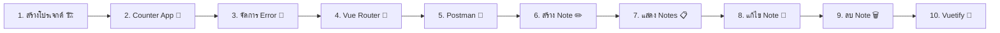

# 📝 Note App Tutorial — เรียน Vue.js ด้วยการสร้าง Note App

> สำหรับนักเรียนที่รู้ HTML, CSS, JavaScript พื้นฐาน → เรียนรู้ Vue.js ทีละขั้นตอน

---

## 🗺️ แผนที่การเรียนรู้



---

## 📚 สารบัญ

### ส่วนที่ 1: พื้นฐาน Vue.js

| บท | หัวข้อ | สิ่งที่เรียนรู้ |
|----|--------|----------------|
| 1 | [สร้างโปรเจกต์ Vue.js ด้วย Vite](./lesson-1-create-project.md) | Vite, โครงสร้างโปรเจกต์, Vue Component, HMR |
| 2 | [Counter App ด้วย Options API](./lesson-2-counter-app.md) | Options API, data(), methods, event handling |
| 3 | [ทำความเข้าใจ Error ใน Vue.js](./lesson-3-vuejs-error.md) | อ่าน error, DevTools, debug technique |

### ส่วนที่ 2: Multi-page App

| บท | หัวข้อ | สิ่งที่เรียนรู้ |
|----|--------|----------------|
| 4 | [สร้าง Multi-page App ด้วย Vue Router](./lesson-4-vue-router.md) | Vue Router, หน้า list/create/edit/delete |

### ส่วนที่ 3: เชื่อมต่อ Backend

| บท | หัวข้อ | สิ่งที่เรียนรู้ |
|----|--------|----------------|
| 5 | [ทดสอบ API ด้วย Postman](./lesson-5-postman.md) | REST API, HTTP methods, Postman |
| 6 | [สร้าง Note (Create)](./lesson-6-create-note.md) | Form, HTTP request, error handling |
| 7 | [แสดงรายการ Note (Read)](./lesson-7-list-note.md) | Table, search, API integration |
| 8 | [แก้ไข Note (Update)](./lesson-8-edit-note.md) | Edit form, route params, update API |
| 9 | [ลบ Note (Delete)](./lesson-9-delete-note.md) | Confirm dialog, delete API |

### ส่วนที่ 4: ตกแต่ง UI

| บท | หัวข้อ | สิ่งที่เรียนรู้ |
|----|--------|----------------|
| 10 | [ใช้ Vuetify ตกแต่ง UI](./lesson-10-vuetify.md) | Vuetify, Material Design, UI components |

---

## 🛠️ สิ่งที่ต้องเตรียมก่อนเริ่ม

- [Node.js](https://nodejs.org/) เวอร์ชัน 18 ขึ้นไป
- [VS Code](https://code.visualstudio.com/) หรือ Code Editor อื่นๆ
- [Git](https://git-scm.com/) สำหรับจัดการโค้ด
- Terminal (Command Prompt, PowerShell, หรือ Terminal บน Mac)

---

## 🚀 วิธีเริ่มเรียน

1. Clone โปรเจกต์นี้
2. เปิดบทที่ 1 แล้วทำตามขั้นตอน
3. ทำ Checkpoint ✅ ทุกจุดให้ผ่าน
4. ลอง Challenge 🏋️ ท้ายแต่ละบท

> 💡 **ตามไม่ทัน?** ทุกบทมี branch สำเร็จให้ checkout ได้:
> ```bash
> git checkout lesson-1-completed
> ```

---

## 📖 คำศัพท์รวม (Glossary)

| คำศัพท์ | ความหมาย | เปรียบเทียบ |
|---------|----------|-------------|
| Component | ชิ้นส่วน UI ที่ reuse ได้ | เหมือนชิ้น LEGO 1 ชิ้น |
| Template | ส่วน HTML ที่กำหนดโครงสร้างหน้าจอ | เหมือนพิมพ์เขียวของบ้าน |
| State | ข้อมูล/สถานะที่เปลี่ยนแปลงได้ในแอป | เหมือนคะแนนในเกม — เปลี่ยนตลอด |
| Reactive | ระบบที่อัปเดต UI อัตโนมัติเมื่อข้อมูลเปลี่ยน | เหมือน Google Sheets — แก้ตัวเลข สูตรก็คำนวณใหม่ |
| Directive | คำสั่งพิเศษของ Vue ในรูป attribute (`v-if`, `v-for`) | เหมือนป้ายคำสั่ง — บอก HTML ว่าต้องทำอะไร |
| Lifecycle | วงจรชีวิตของ Component (สร้าง → แสดง → ทำลาย) | เหมือนชีวิตผีเสื้อ: ไข่ → หนอน → ดักแด้ → ผีเสื้อ |
| Props | ข้อมูลที่ส่งจาก Component แม่ → Component ลูก | เหมือนพ่อแม่ให้เงินลูก |
| Emit | เหตุการณ์ที่ Component ลูกส่งกลับไป Component แม่ | เหมือนลูกโทรบอกพ่อแม่ว่าต้องการอะไร |
| Route | เส้นทาง URL ที่กำหนดว่าแสดงหน้าไหน | เหมือนที่อยู่บ้าน — บอกว่าไปตรงไหน |
| API | ช่องทางที่ Frontend คุยกับ Backend | เหมือนเมนูร้านอาหาร — สั่งได้ตามที่มี |
| CRUD | Create, Read, Update, Delete — 4 ปฏิบัติการพื้นฐานกับข้อมูล | เหมือนสมุดที่: เขียน, อ่าน, ลบ, แก้ |
| HMR | Hot Module Replacement — อัปเดตหน้าเว็บทันทีเมื่อแก้โค้ด | เหมือนเปลี่ยนล้อรถขณะวิ่ง — ไม่ต้องหยุด |
